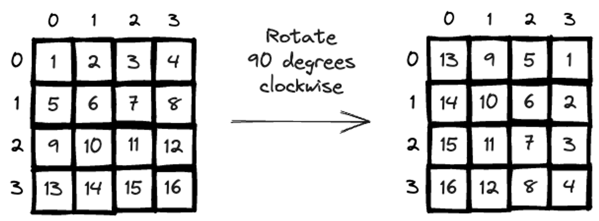

n \* n の行列の matrix と target が与えられます。matrix を 90 度時計回りに回転したときに target と一致するかどうかを判定してください。



```
Input:
    matrix = [
        [1,2,3],
        [4,5,6],
        [7,8,9]
    ]
    target = [
        [7,4,1],
        [8,5,2],
        [9,6,3]
    ]
)
Output: True
```

```
Input:
    matrix = [
        [1,2,3],
        [4,5,6],
        [7,8,9]
    ]
    target = [
        [9,8,7],
				[6,5,4],
			  [3,2,1]
    ]
)
Output: False
Explanation:
# 時計回りに180度回転している
```
